資料視覺化
========================================================
author: 曾意儒 Yi-Ju Tseng
date: 2017/05/08 & 15
autosize: true
font-family: 'Microsoft JhengHei'
navigation: slide


對應書本章節
========================================================
[8 資料視覺化](http://yijutseng.github.io/DataScienceRBook/vis.html)

大綱
====================================
type:sub-section 

- 資料視覺化的目的
- ggplot2
- ggplot2+地圖
- 台灣面量圖
- Heatmap
- Treemap

資料視覺化的目的
====================================
type:sub-section 
- 探索圖 (Exploratory graphs)
    - 了解資料的特性
    - 尋找資料的模式(patterns)
    - 建議資料分析與建模的策略
- 結果圖 (Final graphs)
    - 結果呈現與溝通
    
探索圖特性
====================================
- 很快就可以做一張圖
- 主要目的是了解資料的樣子
- 不用做圖形格式調整美化

結果圖特性
====================================
- 比較，呈現差異
    - 比較什麼？誰跟誰比較？
- 呈現因果關係（causality）,機制（mechanism）,結果解釋（explanation）,系統化的結構（systematic structure）
    - 因果模型？為什麼你想要做這樣的比較
- 呈現多變數（Multivariate）資料
    - 多變數（Multivariate）：超過兩個變數就叫多變數
    - 所有真實事件都是多變數的

結果圖特性
====================================
- 將證據整合呈現
    - 在同一個畫面呈現文字、數字、圖表
    - 盡量用圖形呈現資料
- 將圖表做適當的標記與說明，包括xy軸名稱、單位、資料來源等
    - 資料圖表必須可以呈現你想說的故事
- 內容才是最重要的
    - 資料不好，分析不好，圖表再美也沒有用
    
常用的畫圖套件
====================================
type:sub-section 

- 基本功能(Base)：可自學
- `lattice`：可自學
- `ggplot2`

ggplot2簡介
====================================
type:sub-section 

- Dr. Leland Wilkinson [Grammar of Graphics](http://www.springer.com/us/book/9780387245447)

“In brief, the grammar tells us that a statistical graphic is a `mapping` from data to `aesthetic` attributes (colour, shape, size) of `geometric` objects (points, lines, bars). The plot may also contain statistical transformations of the data and is drawn on a specific coordinate system”

-from `ggplot2` book

ggplot2簡介
====================================
- [Hadley Wickham](http://hadley.nz/)開發
- 一直是最熱門的R packages之一
- [ggplot2 GitHub](https://github.com/tidyverse/ggplot2)

ggplot2簡介
====================================
- 做圖的文法包括兩個最主要元素
    - **Aesthetic attributes**：包括顏色、形狀、點的大小與線的粗細等
    - **Geometric objects**：包括點、線、盒狀圖、直條圖等

- 其他元素
    - **Facets**：提供在同一張圖內做多個子圖的方法，只要使用Faceting功能設定子圖分類的依據參數即可
    - **Stats**：將資料做統計轉換
    - **Scales**：修改點線的顏色、形狀、xy軸的範圍等

qplot() - ggplot2 “Hello, world!”
====================================
- `qplot(x軸名稱,y軸名稱,data=使用資料)`: 散佈圖


```r
library(SportsAnalytics)
NBA1516<-fetch_NBAPlayerStatistics("15-16") 
library(ggplot2) 
qplot(FieldGoalsAttempted, TotalPoints, 
      data = NBA1516)
```


qplot() - Aesthetics
====================================
- 第一個主要元素**Aesthetics**
- 包括顏色、形狀、點的大小與線的粗細
- 加上`color=Position`，用守備位置Position著色


```r
qplot(FieldGoalsAttempted, TotalPoints, 
      data = NBA1516,color=Position)
```

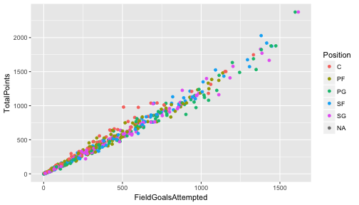


qplot() 預設散佈圖練習
====================================
type:alert
incremental:true

- 讀入內建iris資料
- 用**qplot()**做圖
    - x軸：Sepal.Length
    - y軸：Sepal.Width
    - 顏色：Species

qplot() - Geometric
====================================
- 第二個主要元素**Geometric**
- 包括點、線、盒狀圖、直條圖等
- `geom = c("point", "smooth")` 在圖上加點與漸進線


```r
qplot(FieldGoalsAttempted, TotalPoints, 
      data = NBA1516,
      geom = c("point", "smooth"))
```

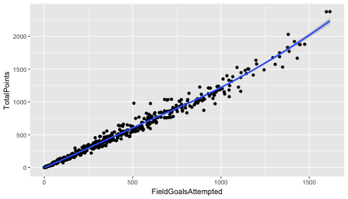

qplot() - Histograms直方圖
====================================
- 是**單**變量
- 預設圖形: **Histograms直方圖**


```r
#fill = Position 用守備位置Position著色
qplot(TotalPoints, data = NBA1516, 
      fill = Position)
```

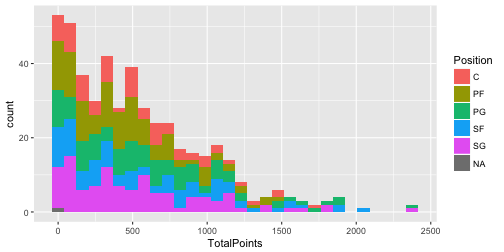

qplot() 預設直方圖練習
====================================
type:alert
incremental:true

- 讀入內建iris資料
- 用**qplot()**做圖
    - 單變量：Petal.Width
    - 顏色：Species

qplot() - Facets
====================================
- 在同一張圖內做多個子圖的方法
- `facets = ` 來設定子圖分類的依據參數
- 設定子圖的語法為**直向分類**~**橫向分類**
    - 直向分類: 增加列（Row）
    - 橫向分類: 增加行（Column）
    - 如果選擇的是`直向`，`橫向分類`部分可用 **.** 表示

qplot() - Facets
====================================
`facets = 直向分類~橫向分類`

```r
#. ~ Position 用守備位置Position分群畫圖(橫向)
qplot(FieldGoalsAttempted, TotalPoints, 
      data = NBA1516,
      facets = . ~ Position)
```

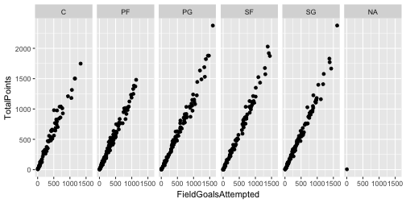

qplot() - Facets
====================================
`facets = 直向分類~橫向分類`

```r
#. ~ Position 用守備位置Position分群畫圖(直向)
qplot(FieldGoalsAttempted, TotalPoints, 
      data = NBA1516,
      facets = Position ~ .)
```

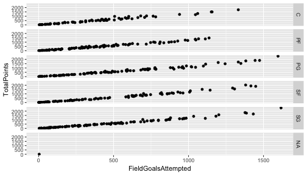

qplot() - 其他參數
====================================
- 自動幫使用者選擇顏色與圖形各項參數
- 使用者也可依需求微調
- 如直方圖的分組間隔，可透過`binwidth`參數設定

```r
qplot(TotalPoints, data = NBA1516, 
      facets = Position ~ ., binwidth = 2)
```

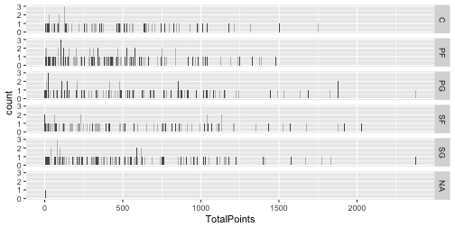

qplot() - 其他參數
====================================

```r
#. ~ Position 用守備位置Position分群畫圖(直向)
#binwidth = 100 每100分一組
qplot(TotalPoints, data = NBA1516,
      facets = Position ~ ., binwidth = 100)
```


qplot() 綜合練習
====================================
type:alert
incremental:true

- 讀入內建iris資料
- 用**qplot()**做圖
    - x軸：Sepal.Length
    - y軸：Sepal.Width
    - 子圖：Species，每個Species畫在新的**欄位**

qplot() - 總結
====================================
- `qplot()`提供快速方便的畫圖功能
- 保留部分參數設定的彈性
- 若需要調整更多參數，仍須使用完整的`ggplot()`函式


ggplot() 
====================================
type:sub-section 

使用ggplot2作圖有以下步驟：

- 準備好資料
- 設定**Aesthetic attributes**
    - 使用`aes(x, y, ...)`指定
- 指定**Geometric objects**
    - `geom_point()`
    - `geom_line()`
    - `geom_polygon()`
    - `geom_errorbar()`

ggplot() 
====================================

```r
library(ggplot2) 
##先安裝 install.packages("ggplot2")
```

- ggplot(data,...)

ggplot() 設定重要元素
====================================
- **Aesthetic attributes**
    - aes(x = Species, y = Sepal.Length)
- **Geometric objects**
    - geom_point()

```r
ggplot(iris, 
       aes(x = Species, y = Sepal.Length)) + 
    geom_point()
```


ggplot() geom_boxpolt()
====================================
用`geom_boxplot()`改畫盒狀圖

```r
ggplot(iris, 
       aes(x = Species, 
           y = Sepal.Length)) + 
    geom_boxplot()
```

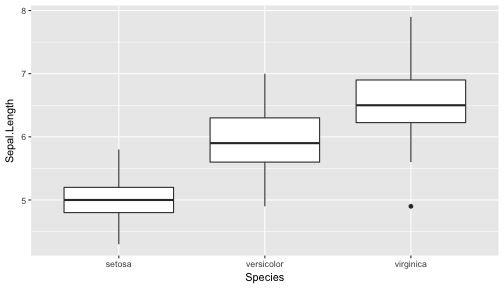

ggplot() Faceting
====================================
**直向分類**~**橫向分類**

```r
ggplot(iris, 
       aes(x = Sepal.Width, 
           y = Sepal.Length)) + 
    geom_point()+facet_grid(Species~.)
```

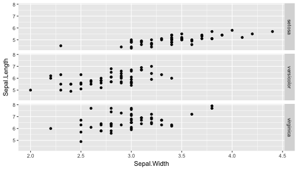

ggplot() Faceting
====================================
**直向分類**~**橫向分類**

```r
ggplot(iris, 
       aes(x = Sepal.Width, 
           y = Sepal.Length)) + 
    geom_point()+facet_grid(.~Species)
```

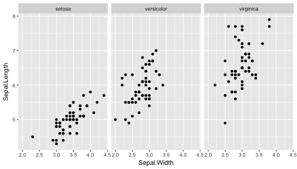

ggplot() geom_smooth()
====================================
替xy散佈圖加上趨勢線

```r
ggplot(iris, 
       aes(x = Sepal.Width, 
           y = Sepal.Length)) + 
    geom_point()+facet_grid(Species~.)+
    geom_smooth()
```

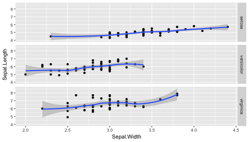

ggplot() geom_smooth()
====================================
替xy散佈圖加上趨勢線，使用linear regresion

```r
ggplot(iris, 
       aes(x = Sepal.Width, 
           y = Sepal.Length)) + 
    geom_point()+facet_grid(Species~.)+
    geom_smooth(method='lm')
```

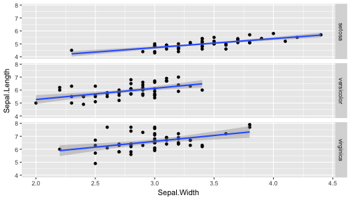

ggplot() geom_line()
====================================
改用`geom_line()`畫線

```r
ggplot(iris, 
       aes(x = Sepal.Width, 
           y = Sepal.Length)) + 
    geom_line()+facet_grid(Species~.)
```

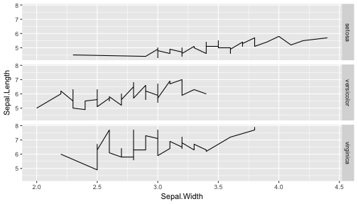

ggplot() 顏色分組
====================================
改用顏色分組，使用`aes(color='group name')`

```r
ggplot(iris, 
       aes(x = Sepal.Width, 
           y = Sepal.Length,
           color=Species)) + 
    geom_line()
```

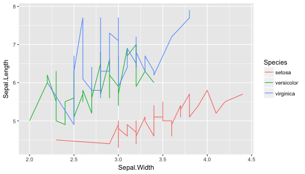

ggplot() 綜合練習 
====================================
type:alert
incremental:true

- 讀入內建iris資料
- 用**ggplot()**畫xy散佈圖
    - x軸：Sepal.Length
    - y軸：Sepal.Width
    - 子圖：Species，每個Species畫在新的**欄位**
- 用**ggplot()**做盒狀圖
    - x軸：Species
    - y軸：Sepal.Width


ggplot() 綜合練習 
====================================
type:alert
incremental:true

- 讀入內建iris資料
- 用**ggplot()**做折線圖
    - x軸：Sepal.Length
    - y軸：Sepal.Width
    - 顏色：Species


ggplot() 注意事項
====================================
- 提供資料時，把資料修改為想要在圖片顯示的文字
- 如果是離散性的資料，但卻又是數值時（像是1,2,3）可以用factor()轉換

ggplot() 資料標示+參數設定
====================================

- 標籤 `xlab()`, `ylab()`, `labs(x=,y=)`, `ggtitle()`
- 每一個`geom_*()`都有參數可設定
- 圖形樣式設定 `theme()`，可使用內建樣式
  - `theme_gray()`: 灰背景，預設樣式
  - `theme_bw()`: 黑白樣式
- 使用其他樣式套件
  - `ggthemes` packages [Website](https://cran.r-project.org/web/packages/ggthemes/vignettes/ggthemes.html)
  - `xkcd` packages [Website](http://xkcd.r-forge.r-project.org/)

ggplot() geom_errorbar()
====================================
- 在比較多組的平均值高低時，因為各組樣本數與資料分佈不同，平均數的誤差值也會不同
- 在資料視覺化時，建議加上誤差線(Error bar)
- 誤差線通常使用在bar chart和line chart
- 誤差值的計算有下列三種選擇：

  - Standard deviation (SD) 標準差：呈現資料本質時使用
  - Standard error (SE) 標準誤差：呈現預估平均值的可能誤差時使用
  - Confidence interval (CI) 信賴區間：呈現預估平均值的信心時使用

ggplot() geom_bar()
====================================
- 以空氣污染料為例，比較各月臭氧濃度差異
- bar chart: 將**Geometric objects**設定為`geom_bar`

```r
library(datasets) 
library(dplyr)
#將Month轉為因子變項
airquality$Month<-as.factor(airquality$Month) 
#計算每月Ozone平均
airquality.mean<-airquality%>%group_by(Month)%>%
    summarise(zoneMean=mean(Ozone,na.rm = T)) 
#stat = "identity" 直接畫數字
ggplot()+geom_bar(data=airquality.mean,
                  aes(x=Month,y=OzoneMean),
                  stat = "identity") 
```

ggplot() geom_bar()
====================================
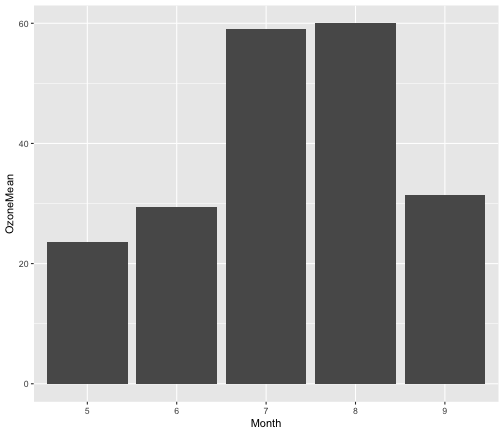

ggplot() geom_errorbar()
====================================
- 加上`geom_errorbar()`函式
- 設定資料高低值，就能在原圖中加上誤差線

```r
#計算每月Ozone平均與標準差
airquality.stat<-airquality.mean<-airquality%>%group_by(Month)%>%
    summarise(OzoneMean=mean(Ozone,na.rm = T)
              OzoneSD=sd(Ozone,na.rm = T))  
ggplot(data=airquality.stat)+ 
    geom_bar(aes(x=Month,y=OzoneMean),
             stat = "identity")+
    geom_errorbar( #ymin低點, ymax高點
        aes(x=Month,ymin=OzoneMean-OzoneSD,
            ymax=OzoneMean+OzoneSD), width=.1)
```

ggplot() geom_errorbar()
====================================
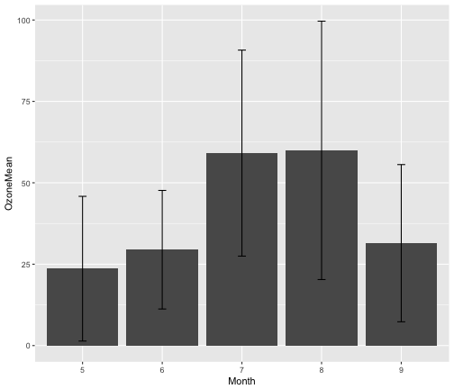

ggplot2 參考資料
====================================
- [ggplot2 官網](http://ggplot2.tidyverse.org/)
- [ggplot2 package source code](https://github.com/tidyverse/ggplot2)
- [ggplot2 cheat sheet](https://www.rstudio.com/wp-content/uploads/2015/03/ggplot2-cheatsheet.pdf)
- [ggplot2 doc](http://docs.ggplot2.org/)


ggplot2+地圖
====================================
type:sub-section 

- Choropleth map面量圖
- ggmap()
- Density Map
- 參考資料

Choropleth map面量圖
====================================
- Choropleth map[面量圖](https://en.wikipedia.org/wiki/Choropleth_map)
- **把統計資料用顏色畫在對應的地圖上**
- `choroplethr` package來畫面量圖
- 基於`ggplot2` package的`面量圖`做圖工具
- 建議同時安裝`choroplethrMaps` package

```r
##第一次使用前先安裝
install.packages(c("choroplethr",
                   "choroplethrMaps")) 
```

```r
library(choroplethr)
```

choroplethr package
====================================
- 內建美國各州地圖與人口學資料
- 使用`state_choropleth()`函式畫出美國人口分布

```r
data(df_pop_state) #記載各州人口數的資料
#把各州人口畫在地圖上
state_choropleth(df_pop_state) 
```

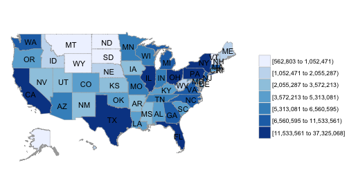

choroplethr package
====================================
若在將`reference_map`設定為` = TRUE`，可在面量圖的背景加上google地圖

```r
data(continental_us_states)
state_choropleth(df_pop_state,
                 reference_map = TRUE,
                 zoom= continental_us_states) 
```

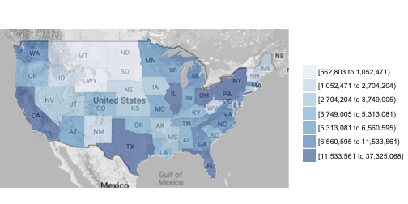


ggmap package
====================================
- 把google map載入並作圖的套件
- 基於`ggplot2`套件開發
- 第一次使用前需要安裝

```r
##第一次使用前先安裝
install.packages("ggmap") 
```
- `get_map()`函式取得google map圖層
    - location 地點，可以是地名，也可以是經緯度座標
    - zoom 放大倍率
    - language 地圖語言
- `ggmap()`函式將取得的圖層畫出來


get_map() + ggmap()
====================================

```r
library(ggmap)
twmap <- get_map(location = 'Taiwan', 
                 zoom = 7,
                 language = "zh-TW")
ggmap(twmap)
```

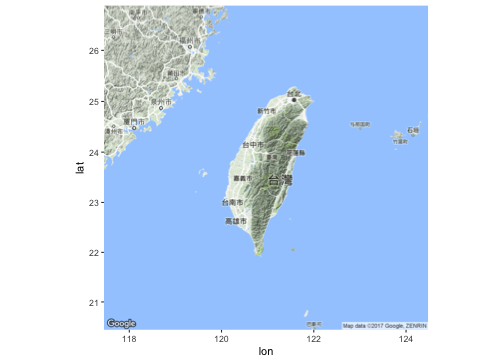

ggmap + open data 資料載入
====================================
- 只要資料有經緯度等資訊，就可以使用`ggmap` package與各式資料結合呈現
- [台北市水質資料](http://data.taipei/opendata/datalist/apiAccess?scope=resourceAquire&rid=190796c8-7c56-42e0-8068-39242b8ec927)

```r
library(jsonlite)
library(RCurl)
WaterData<-fromJSON(getURL("http://data.taipei/opendata/datalist/apiAccess?scope=resourceAquire&rid=190796c8-7c56-42e0-8068-39242b8ec927"))
WaterDataFrame<-WaterData$result$results
WaterDataFrame$longitude<-as.numeric(WaterDataFrame$longitude)
WaterDataFrame$latitude<-as.numeric(WaterDataFrame$latitude)
WaterDataFrame$qua_cntu<-as.numeric(WaterDataFrame$qua_cntu)
WaterDataClean<-WaterDataFrame[WaterDataFrame$qua_cntu>=0,]
head(WaterDataClean)
```

```
  _id update_date update_time       qua_id                code_name
1   1  2017-05-02  00:30:00   CS00                       雙溪淨水場
2   2  2017-05-02  00:30:00   CS01                         衛理女中
3   3  2017-05-02  00:30:00   CS02         雙溪國小                
4   4  2017-05-02  00:30:00   CS03                       華興加壓站
5   5  2017-05-02  00:30:00   CX00                       長興淨水場
6   6  2017-05-02  00:30:00   CX02                         市政大樓
  longitude latitude qua_cntu qua_cl qua_ph
1  121.5609 25.11574     0.02   0.55    7.3
2  121.5440 25.10325     0.07   0.39    7.3
3  121.5556 25.10763     0.07    0.4    7.4
4  121.5348 25.10356     0.12   0.43    7.1
5  121.5404 25.01633     0.02   0.44    7.2
6  121.5566 25.04250     0.05   0.44    7.2
```

ggmap + open data 繪圖
====================================

```r
library(ggmap)
TaipeiMap <- get_map(
    location = c(121.43,24.93,121.62,25.19), 
    zoom = 11, maptype = 'roadmap')
TaipeiMapO <- ggmap(TaipeiMap)+ 
    geom_point(data=WaterDataClean, 
               aes(x=longitude, y=latitude,
                   color=qua_cntu,size=3.5))+ 
    scale_color_continuous(
        low = "yellow",high = "red")+ 
    guides(size=FALSE)
TaipeiMapO
```

ggmap + open data
====================================
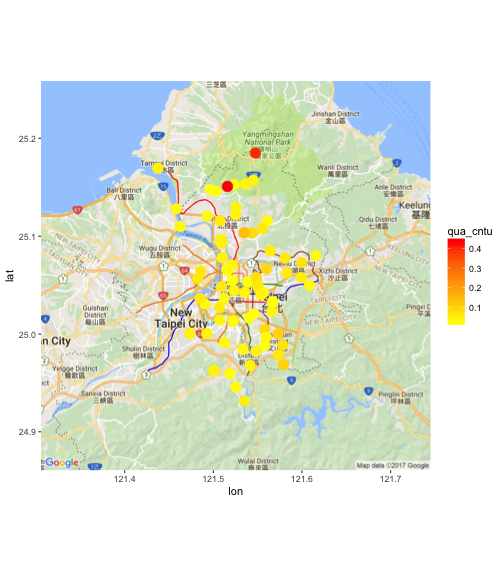

ggmap + 地圖型態
====================================
`ggmap`套件提供多種地圖型態，使用者可透過設定`maptype`自行選擇適合的地圖樣式，樣式有：

- terrain
- terrain-background
- satellite
- roadmap
- hybrid (google maps)
- watercolor
- toner (stamen maps)

ggmap + extent
====================================
透過設定`extent`參數可將地圖輸出樣式改為滿版

```r
library(ggmap)
TaipeiMap = get_map(
    location = c(121.43,24.93,121.62,25.19), 
    zoom = 14, maptype = 'roadmap')
#extent = 'device' 滿版
ggmap(TaipeiMap,extent = 'device') 
```

ggmap + extent
====================================
透過設定`extent`參數可將地圖輸出樣式改為滿版
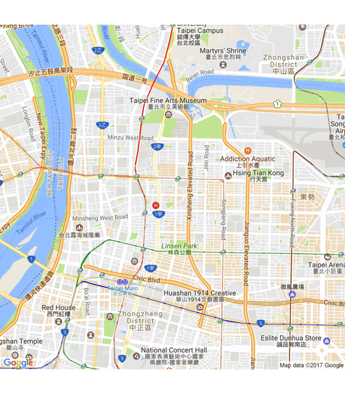

ggmap() 練習 
====================================
type:alert
incremental:true

- 利用get_map() + ggmap()取得桃園地區的google 圖層
    - location = 'Taoyuan'
    - zoom = 11
    - language = "zh-TW"
- 在長庚大學所在地 （座標121.389539,25.035225）加上一個紅色的點
    - geom_point()
    - x= 121.389539
    - y= 25.035225
    - color ="red"

ggmap() 練習輸出圖檔
====================================
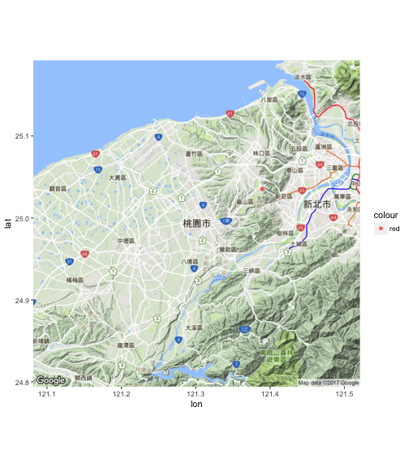


Density Map
====================================
- 常用來表示因地理位置不同的數值差異
- 美國人口密度圖範例 (`ggplot2` + `ggmap`)

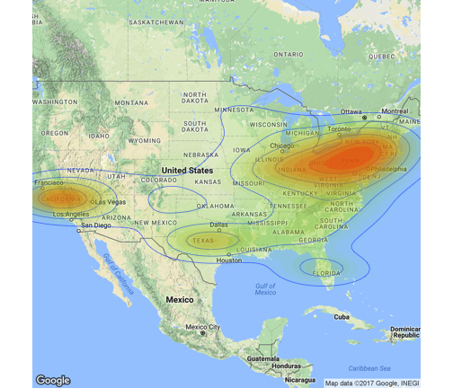

Density Map 資料載入
====================================
取得美國各州中心座標資料以及美國各州人口資料

```r
#取得美國各州中心座標資料
StateCenter<-data.frame( 
    region=tolower(state.name),
    lon=state.center$x,
    lat=state.center$y)
head(StateCenter,1)
```

```
   region      lon     lat
1 alabama -86.7509 32.5901
```

Density Map 資料載入
====================================
取得美國各州中心座標資料以及美國各州人口資料

```r
#美國各州人口資料
StatePop<-merge(df_pop_state,
                StateCenter,by="region") 
head(StatePop,1)
```

```
   region   value      lon     lat
1 alabama 4777326 -86.7509 32.5901
```

Density Map 資料轉換
====================================
- 將人口數字轉換為**資料列數**
- 密度圖是用資料列數來決定畫圖的密度

```r
PopPoint<-NULL 
for(i in 1:nrow(StatePop)){
    #每100萬人轉為1點
    for(j in 1:(StatePop[i,"value"]/1000000)){
        PopPoint<-rbind(PopPoint,StatePop[i,])   
    }
}
head(PopPoint,3)
```

```
   region   value      lon     lat
1 alabama 4777326 -86.7509 32.5901
2 alabama 4777326 -86.7509 32.5901
3 alabama 4777326 -86.7509 32.5901
```

Density Map 作圖
====================================


```r
USMap <- get_map(location = "United States", zoom = 4)
densityMap<-ggmap(USMap, extent = "device") + 
    geom_density2d(data = PopPoint, aes(x = lon, y = lat), size = 0.3) + 
    stat_density2d(data = PopPoint, 
            aes(x = lon, y = lat, 
                fill = ..level.., alpha = ..level..), 
                size = 0.01, bins = 16, geom = "polygon") + 
    scale_fill_gradient(low = "green", 
                        high = "red", guide = FALSE) + 
    scale_alpha(range = c(0, 0.3), guide = FALSE)
densityMap
```

Density Map 作圖
====================================
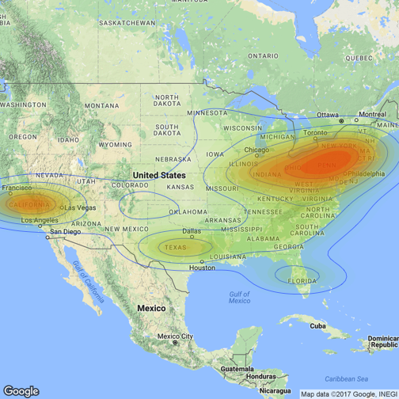

ggmap 參考資料
====================================
- [ggmap package source code](https://github.com/dkahle/ggmap)
- [ggmap cheat sheet](https://www.nceas.ucsb.edu/~frazier/RSpatialGuides/ggmap/ggmapCheatsheet.pdf)
- [ggmap doc](https://dl.dropboxusercontent.com/u/24648660/ggmap%20useR%202012.pdf)

Taiwan的面量圖
====================================
type:sub-section 

- 台灣的面量圖尚無好的套件輔助
- Open Data: 台灣鄉鎮市邊界的經緯度檔案
    - [鄉鎮市區界線](http://data.gov.tw/node/7441)
    - 空間資料開放格式`shapefile` `.shp`
- 使用`shapefile`與`ggplot2`畫圖的步驟如下：
    - 取得空間資料檔案
    - 使用`rgdal`, `rgeos`,`maptools` package處理地圖檔shapefile
    - 使用`ggplot2` & `RColorBrewer` 畫圖

Taiwan的面量圖 範例
====================================


Taiwan的面量圖 處理shapefile-1
====================================

- 需要`rgdal`, `rgeos`,`maptools`


```r
library(ggplot2) 
library(rgdal)#for fortify()
library(rgeos) #for fortify()
library(maptools) #for readShapeSpatial()
#空間資料檔名 請自行下載
tw_new <- readShapeSpatial("Taiwan/Town_MOI_1041215.shp") 
head(tw_new$Town_ID)
```
```
[1] 1001402 1001321 1000913 1001411 1001416 1000712
```

Taiwan的面量圖 處理shapefile-2
====================================

- fortify: 將`shapefile`物件轉為`data.frame`


```r
tw_new.df <- 
    fortify(tw_new, region = "T_UID") 
head(tw_new.df,10)
```
```
       long      lat order  hole piece id group
1  119.9170 26.17518     1 FALSE     1  1   1.1
2  119.9171 26.17517     2 FALSE     1  1   1.1
3  119.9171 26.17518     3 FALSE     1  1   1.1
4  119.9171 26.17518     4 FALSE     1  1   1.1
5  119.9171 26.17518     5 FALSE     1  1   1.1
6  119.9172 26.17518     6 FALSE     1  1   1.1
7  119.9172 26.17518     7 FALSE     1  1   1.1
8  119.9172 26.17518     8 FALSE     1  1   1.1
9  119.9173 26.17515     9 FALSE     1  1   1.1
10 119.9173 26.17515    10 FALSE     1  1   1.1
```

Taiwan的面量圖 著色基準檔
====================================

```r
#做一個假資料來畫
#prevalence設為亂數rnorm(需要的亂數個數)
mydata<-data.frame(NAME_2=tw_new$T_Name, 
                   id=tw_new$T_UID,
                   pre=rnorm(length(tw_new$T_UID)),
                   stringsAsFactors = F)
head(mydata)
```
```
                  NAME_2  id pre
1 \xa6\xa8\xa5\\\xc2\xed 178  1.0551637
2            \xa8ΥV\xb6m 164 -0.6307466
3     \xb3\xc1\xbcd\xb6m 118 -1.2255327
4     \xba\xf1\xaeq\xb6m 376  0.1314583
5  \xc4\xf5\xc0\xac\xb6m 369  1.3665832
6      \xa5Ф\xa4\xc2\xed  78 -0.3132549
```

Taiwan的面量圖 處理中文編碼
====================================
利用iconv將不知所以然的代碼（\xa6\xa8\xa5\\\xc2\xed）轉為看得懂的中文

```r
#from big5 to utf-8  #NAME_2原本是factor
mydata$NAME_2<-
    iconv(mydata$NAME_2,
          from="big5", to = "UTF-8")
head(mydata,10)
```
```
   NAME_2  id pre
1  成功鎮 178  1.0551637
2  佳冬鄉 164 -0.6307466
3  麥寮鄉 118 -1.2255327
4  綠島鄉 376  0.1314583
5  蘭嶼鄉 369  1.3665832
6  田中鎮  78 -0.3132549
7  社頭鄉  83  1.2072224
8  竹田鄉 157  0.7312959
9  萬丹鄉 148  1.4849184
10 三灣鄉  64  0.6094254
```

Taiwan的面量圖 合併資料
====================================
將有prevalence的假數據mydata和經緯度資料tw_new.df合併, 用merge()

```r
final.plot<-merge(tw_new.df,
                  mydata,by="id",all.x=T)
head(final.plot,10)
```
```
   id     long      lat order  hole piece group NAME_2 pre
1   1 119.9170 26.17518     1 FALSE     1   1.1 南竿鄉  0.9584632
2   1 119.9171 26.17517     2 FALSE     1   1.1 南竿鄉  0.9584632
3   1 119.9171 26.17518     3 FALSE     1   1.1 南竿鄉  0.9584632
4   1 119.9171 26.17518     4 FALSE     1   1.1 南竿鄉  0.9584632
5   1 119.9171 26.17518     5 FALSE     1   1.1 南竿鄉  0.9584632
6   1 119.9172 26.17518     6 FALSE     1   1.1 南竿鄉  0.9584632
7   1 119.9172 26.17518     7 FALSE     1   1.1 南竿鄉  0.9584632
8   1 119.9172 26.17518     8 FALSE     1   1.1 南竿鄉  0.9584632
9   1 119.9173 26.17515     9 FALSE     1   1.1 南竿鄉  0.9584632
10  1 119.9173 26.17515    10 FALSE     1   1.1 南竿鄉  0.9584632
```

Taiwan的面量圖 畫台灣面量圖
====================================

```r
library(RColorBrewer) #配色用brewer.pal( 9 , "Reds" )
twcmap<-ggplot() +
    geom_polygon(data = final.plot, 
                 aes(x = long, y = lat, 
                     group = group, 
                     fill = prevalence), 
                 color = "black", 
                 size = 0.25) + 
    coord_map()+#維持地圖比例
    scale_fill_gradientn(
        colours = brewer.pal(9,"Reds"))+
    theme_void()+
    labs(title="Prevalence of X in Taiwan")
twcmap
```

Taiwan的面量圖 
====================================


ggmap+面量圖
====================================

```r
library(ggmap)
twmap <- get_map(location = 'Taiwan', 
                 zoom = 7,
                 language = "zh-TW")
ggmap(twmap)+ #ggmap
    geom_polygon(data = final.plot,  #面量圖
        aes(x = long, y = lat, 
            group = group, fill = pre), 
        color = "grey80", size = 0.1,
        alpha = 0.5) + 
scale_fill_gradientn(
    colours = brewer.pal(9,"Reds"))
```

ggmap+面量圖
====================================
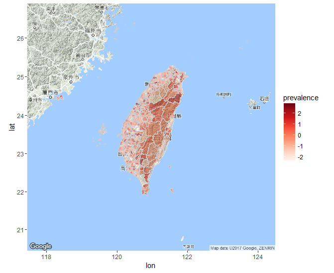

Heatmap
====================================
type:sub-section 
- 熱度圖
- 使用顏色的深淺來表示數值的大小
- 搭配XY兩軸的變量
- 使用一張圖就能表示三個維度的資訊
- 在ggplot2套件中，可以使用`geom_tile()`來畫Heatmap
- 以下以NBA球員的資料作為範例

Heatmap
====================================

```r
#讀.csv檔案
nba <- read.csv("http://datasets.flowingdata.com/ppg2008.csv")
head(nba,3)
```

```
           Name  G  MIN  PTS  FGM  FGA   FGP FTM FTA   FTP X3PM X3PA  X3PP
1  Dwyane Wade  79 38.6 30.2 10.8 22.0 0.491 7.5 9.8 0.765  1.1  3.5 0.317
2 LeBron James  81 37.7 28.4  9.7 19.9 0.489 7.3 9.4 0.780  1.6  4.7 0.344
3  Kobe Bryant  82 36.2 26.8  9.8 20.9 0.467 5.9 6.9 0.856  1.4  4.1 0.351
  ORB DRB TRB AST STL BLK  TO  PF
1 1.1 3.9 5.0 7.5 2.2 1.3 3.4 2.3
2 1.3 6.3 7.6 7.2 1.7 1.1 3.0 1.7
3 1.1 4.1 5.2 4.9 1.5 0.5 2.6 2.3
```

Heatmap
====================================
為了做圖，將寬表轉長表

```r
library(reshape2) #for melt()
#寬表轉長表,以名字作依據
nba.m <- melt(nba,id.vars = "Name") 
head(nba.m,5)
```

|Name          |variable | value|
|:-------------|:--------|-----:|
|Dwyane Wade   |G        |    79|
|LeBron James  |G        |    81|
|Kobe Bryant   |G        |    82|
|Dirk Nowitzki |G        |    81|
|Danny Granger |G        |    67|

geom_tile()
====================================
將Geometric objects指定為`geom_tile()`

```r
library(ggplot2) #for ggplot()
ggplot(nba.m, aes(variable, Name)) + 
    geom_tile(aes(fill = value),
              colour = "white")+ 
    scale_fill_gradient(
        low = "white",high = "steelblue") 
```

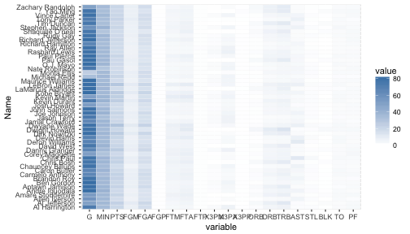

geom_tile() + scale()
====================================
- 因為G欄資料明顯大於其他欄位，導致顏色差異不明顯
- 將個欄位的資料標準化處理


```r
#scale處理
library(dplyr)
nba.s<-nba %>% 
    mutate_each(funs(scale), -Name) 
head(nba.s,2)
```

|Name         |         G|       MIN|      PTS|      FGM|      FGA|       FGP|      FTM|      FTA|        FTP|       X3PM|      X3PA|        X3PP|         ORB|        DRB|        TRB|      AST|      STL|       BLK|       TO|         PF|
|:------------|---------:|---------:|--------:|--------:|--------:|---------:|--------:|--------:|----------:|----------:|---------:|-----------:|-----------:|----------:|----------:|--------:|--------:|---------:|--------:|----------:|
|Dwyane Wade  | 0.6179300| 1.0019702| 3.179941| 2.920022| 2.596832| 0.5136017| 1.917475| 2.110772| -0.7401673| -0.1080044| 0.1303647| -0.15749098| -0.27213551| -0.3465676| -0.3287465| 1.652247| 2.558238| 1.2064646| 1.790445| -0.2984568|
|LeBron James | 0.7693834| 0.6119299| 2.566974| 1.957185| 1.697237| 0.4649190| 1.778729| 1.896589| -0.5233214|  0.4920201| 0.6971679|  0.02738974| -0.06117775|  1.0080940|  0.6605370| 1.516147| 1.367252| 0.8627425| 1.059651| -1.3903719|

geom_tile() + scale()
====================================

```r
nba.s.m <- melt(nba.s) ##寬轉長
ggplot(nba.s.m, aes(variable, Name)) + 
    geom_tile(aes(fill = value),
              colour = "white")+ 
    scale_fill_gradient(
        low = "white",high = "steelblue") 
```

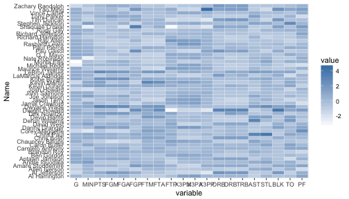

[How to Make a Heatmap – a Quick and Easy Solution](http://flowingdata.com/2010/01/21/how-to-make-a-heatmap-a-quick-and-easy-solution/)

Heatmap 練習 
====================================
type:alert
incremental:true

- 下載[小兒麻痺盛行率](https://raw.githubusercontent.com/CGUIM-BigDataAnalysis/BigDataCGUIM/master/104/POLIO_Incidence.csv)資料
- 將資料載入R
- 表格是寬表，需要轉成長表
- 有缺值 （-），用NA取代
    - 方法一 gsub()
    - 方法二 ifelse()
- 盛行率欄位轉換成數值
    - as.numeric()
- 用年份當x軸，州名當y軸，區塊顏色用盛行率填入
    - low = "white",high = "steelblue"

Treemap
====================================
type:sub-section 
- Treemap(矩形式樹狀結構繪圖法)
- 以二維平面的方式展示包含階層結構（hierarchical）形式的統計資訊
- `treemap` packages

treemap() data
====================================

```r
library(treemap)
data(GNI2014)
knitr::kable(head(GNI2014))
```


|   |iso3 |country          |continent     | population|    GNI|
|:--|:----|:----------------|:-------------|----------:|------:|
|3  |BMU  |Bermuda          |North America |      67837| 106140|
|4  |NOR  |Norway           |Europe        |    4676305| 103630|
|5  |QAT  |Qatar            |Asia          |     833285|  92200|
|6  |CHE  |Switzerland      |Europe        |    7604467|  88120|
|7  |MAC  |Macao SAR, China |Asia          |     559846|  76270|
|8  |LUX  |Luxembourg       |Europe        |     491775|  75990|

treemap()
====================================

```r
library(treemap)
data(GNI2014)
treemap(GNI2014,
       index=c("continent", "iso3"), #分組依據
       vSize="population", #區塊大小
       vColor="GNI", #顏色深淺
       type="value")
```


互動式資料呈現
====================================

- [互動式資料呈現](http://yijutseng.github.io/DataScienceRBook/InteractiveGraphics.html)
- [ggvis](http://yijutseng.github.io/DataScienceRBook/InteractiveGraphics.html#ggvis)
- [googleVis](http://yijutseng.github.io/DataScienceRBook/InteractiveGraphics.html#googlevis)
- [Plot.ly](http://yijutseng.github.io/DataScienceRBook/InteractiveGraphics.html#plot.ly)

參考資料
====================================
type:sub-section 

- 官方網站[文件](http://docs.ggplot2.org/current/)
- RStudio製作的[ggplot cheat sheet](https://www.rstudio.com/wp-content/uploads/2016/11/ggplot2-cheatsheet-2.1.pdf)
- DataCamp課程1 [Data Visualization with ggplot2 (Part 1)](https://www.datacamp.com/courses/data-visualization-with-ggplot2-1)
- DataCamp課程2 [Data Visualization with ggplot2 (Part 2)](https://www.datacamp.com/courses/data-visualization-with-ggplot2-2)
- DataCamp課程3 [Data Visualization with ggplot2 (Part 3)](https://www.datacamp.com/courses/data-visualization-with-ggplot2-3)
- [每個人心中都有一碗巷口的牛肉湯](http://tequila1979.blogspot.tw/2017/01/blog-post.html)

