Pipelines For Data Analysis In R, part 3
========================================================
author: 曾意儒 Yi-Ju Tseng
autosize: true
font-family: 'Microsoft JhengHei'
navigation: slide

資料分析步驟
========================================================
- 資料匯入
- 資料清洗處理並轉換為Tidy data
- **資料分析**
- **資料呈現與視覺化**


資料分析大綱
====================================
type:sub-section 

- 什麼是探索式資料分析
- 量化的分析方式
- dplyr

什麼是探索式資料分析
====================================
type:sub-section 

- 探索式資料分析 (**E**xploratory **D**ata **A**nalysis)
- 在資料量 大/雜/髒 的時候，探索式資料分析非常重要
- 運用**視覺化**、**基本的統計**等工具，反覆的探索**資料特性**，獲取資料所包含的資訊、結構和特點
- 在進行複雜或嚴謹的分析之前，必須要對資料有更多認識，才能訂定**對的資料分析方向**
- 通常**不需要**嚴謹的假設和細節呈現


探索式資料分析
====================================
- 分析各變數間的**關聯性**，看是否有預料之外的有趣發現
- 觀察資料內容是否符合預期，若否，檢查資料**是否有誤**
- 檢查資料是否符合分析前的假設

透過探索性分析來**調整分析的方向**，減少因分析方向錯誤所造成的時間浪費。

探索式資料分析
====================================

- 圖形化Graphical
    - 單變量Univariate
    - 雙變量Bivariate
    - 多變量Multivariate
    
- 量化Quantitative
    - 單變量Univariate
    - 雙變量Bivariate
    - 多變量Multivariate

圖形化的分析
====================================
包括做圖與列表，將會在下章節介紹，本章節著重於量化的分析方式。


量化的分析方式: 單變量
====================================
資料初步統計，量化的分析方式可包含

- 計算集中趨勢
    - 平均值 Mean `mean()`
    - 中位數 Median `median()`
    - 眾數 Mode，R無內建函數，可直接用`table()`找出現次數最多的資料
    
量化的分析方式: 單變量-集中趨勢
====================================

```r
mean(iris$Sepal.Length)
```

```
[1] 5.843333
```

```r
median(iris$Sepal.Length)
```

```
[1] 5.8
```

```r
table(iris$Species)
```

```

    setosa versicolor  virginica 
        50         50         50 
```
    
量化的分析方式: 單變量
====================================
資料初步統計，量化的分析方式可包含

- 計算資料分散程度
    - 最小值 Min `min()`
    - 最大值 Max `max()`
    - 範圍 Range `range()`
    - 四分位差 Quartiles `quantile()`
    - 變異數 Variance `var()`
    - 標準差 Standard deviation `sd()`
    
量化的分析方式: 單變量-分散程度
====================================

```r
min(iris$Sepal.Length)
```

```
[1] 4.3
```

```r
max(iris$Sepal.Length)
```

```
[1] 7.9
```

```r
range(iris$Sepal.Length)
```

```
[1] 4.3 7.9
```

量化的分析方式: 單變量
====================================

```r
quantile(iris$Sepal.Length)
```

```
  0%  25%  50%  75% 100% 
 4.3  5.1  5.8  6.4  7.9 
```

```r
var(iris$Sepal.Length)
```

```
[1] 0.6856935
```

```r
sd(iris$Sepal.Length)
```

```
[1] 0.8280661
```


量化的分析方式: 雙變量
====================================
- 列聯表 Crosstabs `table()`, `prop.table()`
- 相關性 Correlation `cor()`

量化的分析方式: 雙變量-列聯表
====================================
輪子的數目與自手排的關係

```r
table(mtcars$cyl,mtcars$am)
```

```
   
     0  1
  4  3  8
  6  4  3
  8 12  2
```

量化的分析方式: 雙變量-相關性
====================================
油耗跟馬力的關聯性（相關係數）

```r
cor(mtcars$mpg,mtcars$hp)
```

```
[1] -0.7761684
```

量化的分析方式 w/ R
====================================
- 大多可用R的內建函數完成計算
- 但是在探索式分析時，常常需要**資料分組**
    - 觀察**男性**和**女性**的血壓差異
    - **A隊**與**B隊**的三分球命中率差異
    - **中鋒**和**後衛**的助攻次數
    - ...等
- 若只用基本的內建函數計算，相當耗時
    - `data.table`和`dplyr` packages可以快速完成**分組分析**!

data.table 參考文件與資源
====================================
- [官網](https://github.com/Rdatatable/data.table/wiki)
- 指令全集[The data.table R package cheat sheet](https://s3.amazonaws.com/assets.datacamp.com/img/blog/data+table+cheat+sheet.pdf)
- [A data.table R tutorial by DataCamp](https://www.datacamp.com/community/tutorials/data-table-r-tutorial#gs.vzMYa_k)
- DataCamp [互動式教學課程](https://www.datacamp.com/courses/data-table-data-manipulation-r-tutorial)


dplyr
====================================
type:sub-section 

- [Hadley Wickham](http://hadley.nz/)開發
- 使用以下函數分析整理資料：
    - `select()`: 選要分析的欄位，欄位子集 (Column)
    - `filter()`: 選要分析的觀察值，觀察值子集 (Row)
    - `mutate()`: 增加新欄位
    - `summarise()`: 計算統計值

dplyr
====================================
type:sub-section 

- 使用以下函數分析整理資料：
    - `group_by()`: 分組依據
    - `arrange()`: 觀察值排序
    - `rename()`: 欄位重新命名
    - `%>%`: the “pipe” operator 連結上數函式，將所有函式計算串在一起執行

dplyr
====================================

如要使用必須安裝並載入`dplyr` package

```r
install.packages("dplyr") ##安裝
```

```r
library(dplyr) ##載入
```

以上述NBA資料為例，首先先讀入資料

```r
library(SportsAnalytics)
NBA1516<-fetch_NBAPlayerStatistics("15-16")
```

欄位(Column)子集 select() 
====================================
- 針對欄位 (Column)做子集
- `select(資料名稱,欄位條件1,欄位條件2,...)`
- 條件1與條件2是使用**或**的連結概念


欄位(Column)子集 select() 
====================================
- `dplyr`提供幾個方便篩選名稱的函式：
    - `starts_with()`
    - `ends_with()`
    - `contains()`
    - `matches()`: matches a regular expression
    - `num_range()`: num_range("x", 8:11).
    - `one_of()`: variables in character vector
    - `everything()`

詳細說明可在R執行視窗中輸入`?select_helpers`查看。

欄位(Column)子集 select() 
====================================
篩選欄位名稱為`Name`、開頭是`Threes`或是開頭是`FieldGoals`的欄位

```r
##等於NBA1516[,c("Name","ThreesMade","ThreesAttempted",
##   "FieldGoalsMade","FieldGoalsAttempted")]
select1<-
    select(NBA1516,Name,starts_with("Threes"),
            starts_with("FieldGoals"))
head(select1)
```

|Name       | ThreesMade| ThreesAttempted| FieldGoalsMade| FieldGoalsAttempted|
|:----------|----------:|---------------:|--------------:|-------------------:|
|Quincy Acy |         19|              49|            119|                 214|

欄位(Column)子集 select() 
====================================

若想篩選欄位`Name`到欄位`FieldGoalsMade`間的所有欄位，但不想要`GamesPlayed`欄位
- 用`:`串連欄位名稱
- 用`-`去除不要的欄位

```r
##等同於NBA1516[,c(2:4,612)]
select3<-
    select(NBA1516,Name:FieldGoalsMade,-GamesPlayed)
head(select3,3)
```

|Name         |Team |Position | TotalMinutesPlayed| FieldGoalsMade|
|:------------|:----|:--------|------------------:|--------------:|
|Quincy Acy   |SAC  |SF       |                877|            119|
|Jordan Adams |MEM  |SG       |                 15|              2|
|Steven Adams |OKL  |C        |               2019|            261|

觀察值(Row)子集 filter()
====================================
- 是針對列 (Row)做子集
- `filter(資料名稱,篩選條件1,篩選條件2)`篩選條件們是用**且**的邏輯串連
- **出場分鐘數超過2850分鐘**的球員資料，可輸入下列指令

```r
##等於NBA1516[NBA1516$TotalMinutesPlayed>2850,]
filter(NBA1516,TotalMinutesPlayed>2850)
```

|League |Name            |Team |Position | GamesPlayed| TotalMinutesPlayed| FieldGoalsMade| FieldGoalsAttempted| ThreesMade| ThreesAttempted| FreeThrowsMade| FreeThrowsAttempted| OffensiveRebounds| TotalRebounds| Assists| Steals| Turnovers| Blocks| PersonalFouls| Disqualifications| TotalPoints| Technicals| Ejections| FlagrantFouls| GamesStarted|
|:------|:---------------|:----|:--------|-----------:|------------------:|--------------:|-------------------:|----------:|---------------:|--------------:|-------------------:|-----------------:|-------------:|-------:|------:|---------:|------:|-------------:|-----------------:|-----------:|----------:|---------:|-------------:|------------:|
|NBA    |Trevor Ariza    |HOU  |SF       |          81|               2860|            357|                 858|        185|             497|            126|                 161|                67|           366|     188|    161|       113|     26|           177|                 0|        1025|          2|         0|             0|           81|
|NBA    |James Harden    |HOU  |SG       |          82|               3121|            710|                1617|        236|             656|            720|                 837|                63|           502|     612|    138|       374|     51|           229|                 1|        2376|          2|         0|             0|           82|
|NBA    |Gordon Hayward  |UTA  |SG       |          80|               2889|            521|                1202|        143|             410|            393|                 477|                61|           397|     296|     95|       202|     27|           183|                 0|        1578|          0|         0|             0|           80|
|NBA    |Kyle Lowry      |TOR  |PG       |          77|               2853|            512|                1198|        212|             546|            398|                 491|                55|           365|     494|    158|       225|     34|           211|                 1|        1634|          9|         0|             0|           77|
|NBA    |Khris Middleton |MIL  |SF       |          79|               2855|            507|                1144|        143|             362|            277|                 312|                45|           301|     331|    131|       180|     19|           204|                 1|        1434|          5|         0|             0|           79|
|NBA    |Marcus Morris   |DET  |SF       |          80|               2852|            410|                 945|        108|             297|            203|                 271|                91|           404|     201|     67|       140|     23|           170|                 1|        1131|         11|         0|             0|           80|
|NBA    |Kemba Walker    |CHA  |PG       |          81|               2885|            568|                1332|        182|             490|            371|                 438|                56|           358|     421|    127|       171|     39|           111|                 0|        1689|          5|         0|             0|           81|

觀察值(Row)子集 filter()
====================================
也可選擇隊伍名稱為"BOS"或"SAN"的球員資料

```r
##等於NBA1516[NBA1516$Team %in% c("BOS","SAN"),]
filter(NBA1516,Team %in% c("BOS","SAN"))
```

|League |Name             |Team |Position | GamesPlayed| TotalMinutesPlayed| FieldGoalsMade| FieldGoalsAttempted| ThreesMade| ThreesAttempted| FreeThrowsMade| FreeThrowsAttempted| OffensiveRebounds| TotalRebounds| Assists| Steals| Turnovers| Blocks| PersonalFouls| Disqualifications| TotalPoints| Technicals| Ejections| FlagrantFouls| GamesStarted|
|:------|:----------------|:----|:--------|-----------:|------------------:|--------------:|-------------------:|----------:|---------------:|--------------:|-------------------:|-----------------:|-------------:|-------:|------:|---------:|------:|-------------:|-----------------:|-----------:|----------:|---------:|-------------:|------------:|
|NBA    |Lamarcu Aldridge |SAN  |PF       |          74|               2260|            536|                1045|          0|              16|            259|                 302|               175|           631|     110|     38|        99|     81|           151|                 0|        1331|          0|         0|             0|           74|
|NBA    |Kyle Anderson    |SAN  |SF       |          78|               1247|            138|                 296|         12|              37|             62|                  83|                25|           245|     123|     60|        59|     29|            97|                 0|         350|          0|         0|             0|           11|
|NBA    |Matt Bonner      |SAN  |C        |          30|                210|             29|                  58|         15|              35|              3|                   4|                 3|            27|       9|      6|         3|      1|            16|                 0|          76|          0|         0|             0|            2|
|NBA    |Avery Bradley    |BOS  |PG       |          76|               2536|            456|                1018|        147|             406|             96|                 123|                48|           220|     158|    117|       109|     19|           164|                 2|        1155|          0|         0|             0|           72|
|NBA    |Rasual Butler    |SAN  |SF       |          46|                432|             49|                 105|         15|              49|             11|                  16|                 3|            56|      24|     13|         8|     23|            11|                 0|         124|          0|         0|             0|            0|
|NBA    |Coty Clarke      |BOS  |NA       |           4|                  8|              2|                   4|          2|               2|              0|                   0|                 0|             1|       0|      0|         1|      0|             0|                 0|           6|          0|         0|             0|            0|


觀察值(Row)子集 filter()
====================================
也可使用 `&` 和 `|`等符號串連邏輯

```r
filter(NBA1516,
       FieldGoalsMade/FieldGoalsAttempted>0.7
           &GamesPlayed>30)
```

|League |Name           |Team |Position | GamesPlayed| TotalMinutesPlayed| FieldGoalsMade| FieldGoalsAttempted| ThreesMade| ThreesAttempted| FreeThrowsMade| FreeThrowsAttempted| OffensiveRebounds| TotalRebounds| Assists| Steals| Turnovers| Blocks| PersonalFouls| Disqualifications| TotalPoints| Technicals| Ejections| FlagrantFouls| GamesStarted|
|:------|:--------------|:----|:--------|-----------:|------------------:|--------------:|-------------------:|----------:|---------------:|--------------:|-------------------:|-----------------:|-------------:|-------:|------:|---------:|------:|-------------:|-----------------:|-----------:|----------:|---------:|-------------:|------------:|
|NBA    |Deandre Jordan |LAC  |C        |          77|               2600|            357|                 507|          0|               1|            266|                 619|               267|          1059|      90|     52|       107|    176|           207|                 1|         980|         10|         0|             0|           77|

dplyr 子集練習
====================================
type:alert
incremental:true

- 讀入NBA資料

```r
library(SportsAnalytics)
library(dplyr)
NBA1516<-fetch_NBAPlayerStatistics("15-16")
```
- 試著用dplyr語法篩選出所有**助攻數(Assists)超過100**且**抄截數大於20**的球員資料
- 只留下Name Team Position GamesPlayed TotalMinutesPlayed Assists Steals 七個欄位


增加新欄位 mutate()
====================================
- 新增新欄位`FGRate`，欄位值為`FieldGoalsMade/FieldGoalsAttempted`

```r
mutate1<-
    mutate(NBA1516,
           FGRate=FieldGoalsMade/FieldGoalsAttempted)
mutate1$FGRate[1:5]
```

```
[1] 0.5560748 0.3333333 0.6126761 0.4430538 0.4777070
```

計算統計值 summarise() 
====================================
- **球員個數**、**不重複的隊伍數**以及**不重複的守備位置數**等
- n(), n_distinct()

```r
summarise(NBA1516,
          nPlayer=n(),
          nTeam=n_distinct(Team),
          nPos=n_distinct(Position))
```

```
  nPlayer nTeam nPos
1     476    31    6
```

計算統計值 summarise() 
====================================
- 通常會與其他功能合併使用
- 計算**出場分鐘數大於2500分鐘**的**球員個數**、**平均投進的兩分球數**以及**平均投出的兩分球數**

```r
filter1<-filter(NBA1516,TotalMinutesPlayed>2500)
summarise(filter1,
          nPlayer=n(),
          meanFGMade=mean(FieldGoalsMade),
          meanFGAtt=mean(FieldGoalsAttempted))
```

```
  nPlayer meanFGMade meanFGAtt
1      40        512    1120.6
```

dplyr filter()+summarise() 練習
====================================
type:alert
incremental:true

- 讀入NBA資料

```r
library(SportsAnalytics)
library(dplyr)
NBA1516<-fetch_NBAPlayerStatistics("15-16")
```
- 試著用dplyr語法篩選出所有**助攻數(Assists)超過100**且**抄截數大於20**的球員資料
- 計算這些球員的**平均出場數GamesPlayed**，**平均出場分鐘數TotalMinutesPlayed**

pipe %>%
====================================
- 直接用**pipe**符號`%>%`將指令串連，減少暫存物件（filter1）的生成

```r
filter(NBA1516,TotalMinutesPlayed>2500) %>%
    summarise(nPlayer=n(),
        meanFGMade=mean(FieldGoalsMade),
        meanFGAtt=mean(FieldGoalsAttempted))
```

```
  nPlayer meanFGMade meanFGAtt
1      40        512    1120.6
```

分組 group_by()
====================================
- 設定分組依據
- 與`summarise()`函式合併使用
- 計算各**隊**（以Team作為分組依據）的**球員數**、**平均投進的兩分球數**以及**平均投出的兩分球數**

```r
group_by(NBA1516,Team)%>%
    summarise(nPlayer=n(),
        meanFGMade=mean(FieldGoalsMade),
        meanFGAtt=mean(FieldGoalsAttempted))
```

|Team | nPlayer| meanFGMade| meanFGAtt|
|:----|-------:|----------:|---------:|
|ATL  |      15|   215.0000|  471.1333|
|BOS  |      15|   208.6000|  475.0667|
|BRO  |      16|   181.0625|  395.8750|
|CHA  |      14|   199.1429|  450.7857|

分組 group_by()
====================================
- 可設定**多個**分組依據
- 計算各**隊**各**守備位置**（以Team和Position作為分組依據）的**球員數**、**平均投進的兩分球數**以及**平均投出的兩分球數**

```r
group_by(NBA1516,Team,Position)%>%
  summarise(nPlayer=n(),
        meanFGMade=mean(FieldGoalsMade),
        meanFGAtt=mean(FieldGoalsAttempted))
```

|Team |Position | nPlayer| meanFGMade| meanFGAtt|
|:----|:--------|-------:|----------:|---------:|
|ATL  |C        |       1|    11.0000|   19.0000|
|ATL  |PF       |       6|   247.3333|  515.6667|
|ATL  |PG       |       2|   381.5000|  884.0000|

排序 arrange()
====================================
排序功能，預設為**遞增排序**

```r
arrange(NBA1516,TotalMinutesPlayed)
```

|League |Name             |Team |Position | GamesPlayed| TotalMinutesPlayed| FieldGoalsMade| FieldGoalsAttempted| ThreesMade| ThreesAttempted| FreeThrowsMade| FreeThrowsAttempted| OffensiveRebounds| TotalRebounds| Assists| Steals| Turnovers| Blocks| PersonalFouls| Disqualifications| TotalPoints| Technicals| Ejections| FlagrantFouls| GamesStarted|
|:------|:----------------|:----|:--------|-----------:|------------------:|--------------:|-------------------:|----------:|---------------:|--------------:|-------------------:|-----------------:|-------------:|-------:|------:|---------:|------:|-------------:|-----------------:|-----------:|----------:|---------:|-------------:|------------:|
|NBA    |J.j. O'brien     |UTA  |SF       |           1|                  2|              0|                   1|          0|               0|              0|                   0|                 0|             0|       0|      0|         0|      0|             0|                 0|           0|          0|         0|             0|            0|
|NBA    |Rakeem Christmas |IND  |PF       |           1|                  6|              2|                   2|          0|               0|              0|                   0|                 1|             1|       0|      0|         0|      0|             1|                 0|           4|          0|         0|             0|            0|
|NBA    |Th Antetokounmpo |NYK  |SF       |           3|                  7|              3|                   4|          0|               1|              0|                   0|                 0|             1|       0|      0|         0|      0|             2|                 0|           6|          0|         0|             0|            0|
|NBA    |Sam Dekker       |HOU  |SF       |           3|                  7|              0|                   0|          0|               0|              0|                   0|                 0|             1|       0|      1|         0|      0|             0|                 0|           0|          0|         0|             0|            0|
|NBA    |Coty Clarke      |BOS  |NA       |           4|                  8|              2|                   4|          2|               2|              0|                   0|                 0|             1|       0|      0|         1|      0|             0|                 0|           6|          0|         0|             0|            0|
|NBA    |Jordan Adams     |MEM  |SG       |           2|                 15|              2|                   6|          0|               1|              3|                   5|                 0|             2|       3|      3|         2|      0|             2|                 0|           7|          0|         0|             0|            0|

遞減排序 arrange()
====================================
使用`desc()`將要**遞減排序**的變數包起來，就可以遞減排序

```r
arrange(NBA1516,
        desc(TotalMinutesPlayed),
        desc(GamesPlayed))
```

|League |Name           |Team |Position | GamesPlayed| TotalMinutesPlayed| FieldGoalsMade| FieldGoalsAttempted| ThreesMade| ThreesAttempted| FreeThrowsMade| FreeThrowsAttempted| OffensiveRebounds| TotalRebounds| Assists| Steals| Turnovers| Blocks| PersonalFouls| Disqualifications| TotalPoints| Technicals| Ejections| FlagrantFouls| GamesStarted|
|:------|:--------------|:----|:--------|-----------:|------------------:|--------------:|-------------------:|----------:|---------------:|--------------:|-------------------:|-----------------:|-------------:|-------:|------:|---------:|------:|-------------:|-----------------:|-----------:|----------:|---------:|-------------:|------------:|
|NBA    |James Harden   |HOU  |SG       |          82|               3121|            710|                1617|        236|             656|            720|                 837|                63|           502|     612|    138|       374|     51|           229|                 1|        2376|          2|         0|             0|           82|
|NBA    |Gordon Hayward |UTA  |SG       |          80|               2889|            521|                1202|        143|             410|            393|                 477|                61|           397|     296|     95|       202|     27|           183|                 0|        1578|          0|         0|             0|           80|
|NBA    |Kemba Walker   |CHA  |PG       |          81|               2885|            568|                1332|        182|             490|            371|                 438|                56|           358|     421|    127|       171|     39|           111|                 0|        1689|          5|         0|             0|           81|

dplyr綜合範例
====================================
- 結合`group_by()`、`summarise()`、`arrange()`，可完成一連串的資料分析
- 計算各**隊**各**守備**位置（以Team和Position作為分組依據）的球員數、平均投進的兩分球數以及平均投出的兩分球數，並依平均投進的兩分球數**由大到小排序**

```r
group_by(NBA1516,Team,Position) %>%
  summarise(nPlayer=n(),
    meanFGMade=mean(FieldGoalsMade),
    meanFGAtt=mean(FieldGoalsAttempted)) %>%
  arrange(desc(meanFGMade))
```

|Team |Position | nPlayer| meanFGMade| meanFGAtt|
|:----|:--------|-------:|----------:|---------:|
|GSW  |PG       |       2|        504|       988|
|CLE  |SF       |       2|        440|       864|
|ORL  |SG       |       1|        425|       969|

修改欄位名稱 rename()
====================================
`新名稱=舊名稱`

```r
rename1<-rename(NBA1516,Po=Position)
rename1[1:5,1:5]
```

```
  League          Name Team Po GamesPlayed
1    NBA    Quincy Acy  SAC SF          59
2    NBA  Jordan Adams  MEM SG           2
3    NBA  Steven Adams  OKL  C          80
4    NBA Arron Afflalo  NYK SG          71
5    NBA Alexis Ajinca  NOR  C          59
```

dplyr 綜合練習
====================================
type:alert
incremental:true

- 讀入NBA資料

```r
library(SportsAnalytics)
library(dplyr)
NBA1516<-fetch_NBAPlayerStatistics("15-16")
```
- 試著用dplyr語法篩選出所有**助攻數(Assists)超過100**且**抄截數大於20**的球員資料
- 依**守備位置**Position分組，計算球員的平均**出場數**GamesPlayed，平均**出場分鐘數**TotalMinutesPlayed
- 依平均出場數GamesPlayed**由大到小**排序
- 用pipe **%>%**

dplyr 參考文件與資源
====================================
- [Introduction to dplyr](https://cran.rstudio.com/web/packages/dplyr/vignettes/introduction.html)
- DataCamp互動式教學課程 [Data Manipulation in R with dplyr](https://www.datacamp.com/courses/dplyr-data-manipulation-r-tutorial)


長表與寬表
====================================
type:sub-section

- 在資料處理的過程中，常因各種需求，需要執行長寬表互換的動作
- reshape2 package提供完整的轉換功能
    - 寬表轉長表 `melt(資料框/寬表,id.vars=需要保留的欄位)`
    - 長表轉寬表 `dcast(資料框/長表,寬表分列依據~分欄位依據)`
    
長表與寬表
====================================
原來的`airquality`資料框中，有Ozone, Solar.R, Wind, Temp, Month, Day等六個欄位 (Column)，屬於寬表

```r
head(airquality,3)
```

| Ozone| Solar.R| Wind| Temp| Month| Day|
|-----:|-------:|----:|----:|-----:|---:|
|    41|     190|  7.4|   67|     5|   1|
|    36|     118|  8.0|   72|     5|   2|
|    12|     149| 12.6|   74|     5|   3|

寬表轉長表 melt（）
====================================

- 保留Month和Day兩個欄位
- 將其他欄位的名稱整合至variable欄位，數值整合至value欄位

```r
library(reshape2)
airqualityM<-melt(airquality,id.vars = c("Month","Day")) ##欄位需要保留"Month","Day"
```

```r
head(airqualityM)
```

| Month| Day|variable | value|
|-----:|---:|:--------|-----:|
|     5|   1|Ozone    |    41|
|     5|   2|Ozone    |    36|
|     5|   3|Ozone    |    12|
|     5|   4|Ozone    |    18|
|     5|   5|Ozone    |    NA|
|     5|   6|Ozone    |    28|

長表轉寬表 dcast（）
====================================

- `airqualityM`資料框中，剩下Month, Day, variable, value等四個欄位 (Column)，屬於長表
- variable欄位的值轉換為新欄位，並將value欄位填回新增的欄位


```r
#欄位保留"Month","Day"外，其他欄位由variable定義
airqualityCast<-dcast(airqualityM, Month +Day~variable) 
```

```r
head(airqualityCast)
```

| Month| Day| Ozone| Solar.R| Wind| Temp|
|-----:|---:|-----:|-------:|----:|----:|
|     5|   1|    41|     190|  7.4|   67|
|     5|   2|    36|     118|  8.0|   72|
|     5|   3|    12|     149| 12.6|   74|
|     5|   4|    18|     313| 11.5|   62|
|     5|   5|    NA|      NA| 14.3|   56|
|     5|   6|    28|      NA| 14.9|   66|


資料視覺化大綱
====================================
type:sub-section 

- 資料視覺化的目的
- ggplot2
- ggplot2+地圖
- 台灣面量圖
- Heatmap
- Treemap

資料視覺化的目的
====================================
type:sub-section 
- 探索圖 (Exploratory graphs)
    - 了解資料的特性
    - 尋找資料的模式(patterns)
    - 建議資料分析與建模的策略
- 結果圖 (Final graphs)
    - 結果呈現與溝通
    
探索圖特性
====================================
- 很快就可以做一張圖
- 主要目的是了解資料的樣子
- 不用做圖形格式調整美化

結果圖特性
====================================
- 比較，呈現差異
    - 比較什麼？誰跟誰比較？
- 呈現因果關係（causality）,機制（mechanism）,結果解釋（explanation）,系統化的結構（systematic structure）
    - 因果模型？為什麼你想要做這樣的比較
- 呈現多變數（Multivariate）資料
    - 多變數（Multivariate）：超過兩個變數就叫多變數
    - 所有真實事件都是多變數的

結果圖特性
====================================
- 將證據整合呈現
    - 在同一個畫面呈現文字、數字、圖表
    - 盡量用圖形呈現資料
- 將圖表做適當的標記與說明，包括xy軸名稱、單位、資料來源等
    - 資料圖表必須可以呈現你想說的故事
- 內容才是最重要的
    - 資料不好，分析不好，圖表再美也沒有用
    
常用的畫圖套件
====================================
type:sub-section 

- 基本功能(Base)：可自學
- `lattice`：可自學
- `ggplot2`

ggplot2簡介
====================================
type:sub-section 

- Dr. Leland Wilkinson [Grammar of Graphics](http://www.springer.com/us/book/9780387245447)

“In brief, the grammar tells us that a statistical graphic is a `mapping` from data to `aesthetic` attributes (colour, shape, size) of `geometric` objects (points, lines, bars). The plot may also contain statistical transformations of the data and is drawn on a specific coordinate system”

-from `ggplot2` book

ggplot2簡介
====================================
- [Hadley Wickham](http://hadley.nz/)開發
- 一直是最熱門的R packages之一
- [ggplot2 GitHub](https://github.com/tidyverse/ggplot2)

ggplot2簡介
====================================
- 做圖的文法包括兩個最主要元素
    - **Aesthetic attributes**：包括顏色、形狀、點的大小與線的粗細等
    - **Geometric objects**：包括點、線、盒狀圖、直條圖等

- 其他元素
    - **Facets**：提供在同一張圖內做多個子圖的方法，只要使用Faceting功能設定子圖分類的依據參數即可
    - **Stats**：將資料做統計轉換
    - **Scales**：修改點線的顏色、形狀、xy軸的範圍等

ggplot() 
====================================
type:sub-section 

使用ggplot2作圖有以下步驟：

- 準備好資料
- 設定**Aesthetic attributes**
    - 使用`aes(x, y, ...)`指定
- 指定**Geometric objects**
    - `geom_point()`
    - `geom_line()`
    - `geom_polygon()`
    - `geom_errorbar()`

ggplot() 
====================================

```r
library(ggplot2) 
##先安裝 install.packages("ggplot2")
```

- ggplot(data,...)

ggplot() 設定重要元素
====================================
- **Aesthetic attributes**
    - aes(x = Species, y = Sepal.Length)
- **Geometric objects**
    - geom_point()

```r
ggplot(iris, 
       aes(x = Species, y = Sepal.Length)) + 
    geom_point()
```

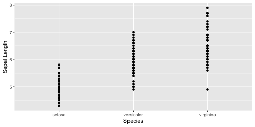

ggplot() geom_boxpolt()
====================================
用`geom_boxplot()`改畫盒狀圖

```r
ggplot(iris, 
       aes(x = Species, 
           y = Sepal.Length)) + 
    geom_boxplot()
```

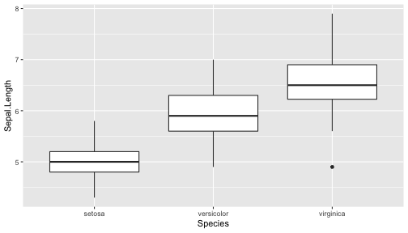

ggplot() Faceting
====================================
**直向分類**~**橫向分類**

```r
ggplot(iris, 
       aes(x = Sepal.Width, 
           y = Sepal.Length)) + 
    geom_point()+facet_grid(Species~.)
```


ggplot() Faceting
====================================
**直向分類**~**橫向分類**

```r
ggplot(iris, 
       aes(x = Sepal.Width, 
           y = Sepal.Length)) + 
    geom_point()+facet_grid(.~Species)
```

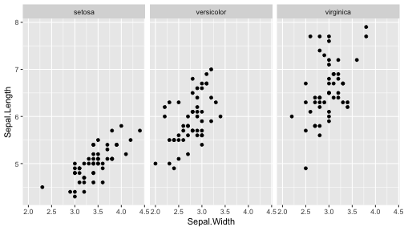

ggplot() geom_smooth()
====================================
替xy散佈圖加上趨勢線

```r
ggplot(iris, 
       aes(x = Sepal.Width, 
           y = Sepal.Length)) + 
    geom_point()+facet_grid(Species~.)+
    geom_smooth()
```

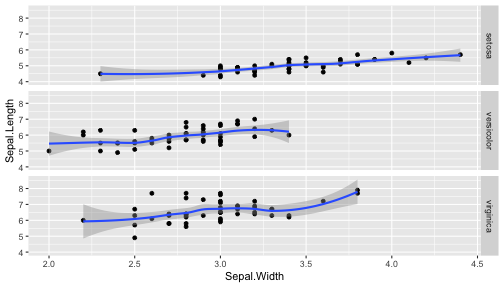

ggplot() geom_smooth()
====================================
替xy散佈圖加上趨勢線，使用linear regresion

```r
ggplot(iris, 
       aes(x = Sepal.Width, 
           y = Sepal.Length)) + 
    geom_point()+facet_grid(Species~.)+
    geom_smooth(method='lm')
```

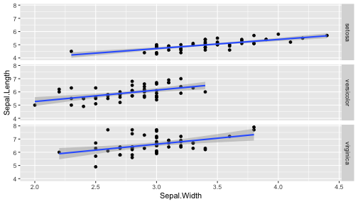

ggplot() geom_line()
====================================
改用`geom_line()`畫線

```r
ggplot(iris, 
       aes(x = Sepal.Width, 
           y = Sepal.Length)) + 
    geom_line()+facet_grid(Species~.)
```

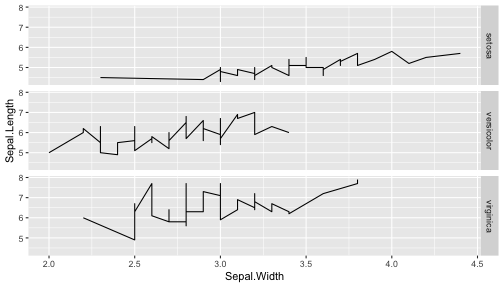

ggplot() 顏色分組
====================================
改用顏色分組，使用`aes(color='group name')`

```r
ggplot(iris, 
       aes(x = Sepal.Width, 
           y = Sepal.Length,
           color=Species)) + 
    geom_line()
```

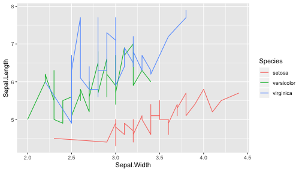

ggplot() 綜合練習 
====================================
type:alert
incremental:true

- 讀入內建iris資料
- 用**ggplot()**畫xy散佈圖
    - x軸：Sepal.Length
    - y軸：Sepal.Width
    - 子圖：Species，每個Species畫在新的**欄位**
- 用**ggplot()**做盒狀圖
    - x軸：Species
    - y軸：Sepal.Width


ggplot() 注意事項
====================================
- 提供資料時，把資料修改為想要在圖片顯示的文字
- 如果是離散性的資料，但卻又是數值時（像是1,2,3）可以用factor()轉換

ggplot() 資料標示+參數設定
====================================

- 標籤 `xlab()`, `ylab()`, `labs(x=,y=)`, `ggtitle()`
- 每一個`geom_*()`都有參數可設定
- 圖形樣式設定 `theme()`，可使用內建樣式
  - `theme_gray()`: 灰背景，預設樣式
  - `theme_bw()`: 黑白樣式
- 使用其他樣式套件
  - `ggthemes` packages [Website](https://cran.r-project.org/web/packages/ggthemes/vignettes/ggthemes.html)
  - `xkcd` packages [Website](http://xkcd.r-forge.r-project.org/)

ggplot2 參考資料
====================================
- [ggplot2 官網](http://ggplot2.tidyverse.org/)
- [ggplot2 package source code](https://github.com/tidyverse/ggplot2)
- [ggplot2 cheat sheet](https://www.rstudio.com/wp-content/uploads/2015/03/ggplot2-cheatsheet.pdf)
- [ggplot2 doc](http://docs.ggplot2.org/)


ggplot2+地圖
====================================
type:sub-section 

- Choropleth map面量圖
- ggmap()
- Density Map
- 參考資料


ggmap package
====================================
- 把google map載入並作圖的套件
- 基於`ggplot2`套件開發
- 第一次使用前需要安裝

```r
##第一次使用前先安裝
install.packages("ggmap") 
```
- `get_googlemap()`函式取得google map圖層
    - center 中心點經緯度座標
    - zoom 放大倍率
    - language 地圖語言
- `ggmap()`函式將取得的圖層畫出來


get_googlemap() + ggmap()
====================================

```r
library(ggmap)
twmap <- get_googlemap(center = c(lon=120.58,lat=23.58), 
                  zoom = 7,
                  language = "zh-TW")
ggmap(twmap)
```

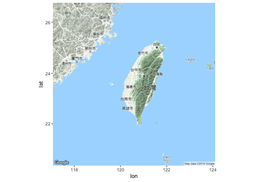

ggmap + open data 資料載入
====================================
- 只要資料有經緯度等資訊，就可以使用`ggmap` package與各式資料結合呈現
- [台北市水質資料](http://data.taipei/opendata/datalist/apiAccess?scope=resourceAquire&rid=190796c8-7c56-42e0-8068-39242b8ec927)

```r
library(jsonlite)
library(RCurl)
WaterData<-fromJSON(getURL("http://data.taipei/opendata/datalist/apiAccess?scope=resourceAquire&rid=190796c8-7c56-42e0-8068-39242b8ec927"))
WaterDataFrame<-WaterData$result$results
WaterDataFrame$longitude<-as.numeric(WaterDataFrame$longitude)
WaterDataFrame$latitude<-as.numeric(WaterDataFrame$latitude)
WaterDataFrame$qua_cntu<-as.numeric(WaterDataFrame$qua_cntu)
WaterDataClean<-WaterDataFrame[WaterDataFrame$qua_cntu>=0,]
head(WaterDataClean)
```

```
  _id update_date update_time       qua_id                code_name
1   1  2018-05-25  21:30:00   CS00                       雙溪淨水場
2   2  2018-05-25  21:30:00   CS01                         衛理女中
3   3  2018-05-25  21:30:00   CS02         雙溪國小                
4   4  2018-05-25  21:30:00   CS03                       華興加壓站
5   5  2018-05-25  21:30:00   CX00                       長興淨水場
6   6  2018-05-25  21:30:00   CX02                         市政大樓
  longitude latitude qua_cntu qua_cl qua_ph
1  121.5609 25.11574     0.05   0.61    7.7
2  121.5440 25.10325     0.10   0.29    7.6
3  121.5556 25.10763     0.06   0.47    7.7
4  121.5348 25.10356     0.15   0.35    7.1
5  121.5404 25.01633     0.03   0.58    7.3
6  121.5566 25.04250     0.06    0.6    7.2
```

ggmap + open data 繪圖
====================================

```r
library(ggmap)
TaipeiMap <- get_googlemap(
    center  = c(lon=121.50,lat=25.06), 
    zoom = 11, maptype = 'roadmap')
TaipeiMapO <- ggmap(TaipeiMap)+ 
    geom_point(data=WaterDataClean, 
               aes(x=longitude, y=latitude,
                   color=qua_cntu,size=3.5))+ 
    scale_color_continuous(
        low = "yellow",high = "red")+ 
    guides(size=FALSE)
TaipeiMapO
```

ggmap + open data
====================================
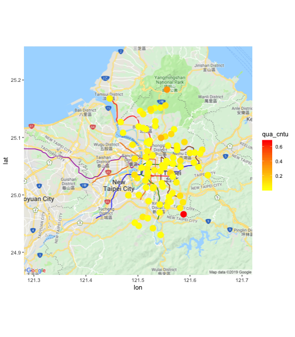

ggmap + 地圖型態
====================================
`ggmap`套件提供多種地圖型態，使用者可透過設定`maptype`自行選擇適合的地圖樣式，樣式有：

- terrain
- terrain-background
- satellite
- roadmap
- hybrid (google maps)
- watercolor
- toner (stamen maps)

ggmap + extent
====================================
透過設定`extent`參數可將地圖輸出樣式改為滿版

```r
library(ggmap)
#extent = 'device' 滿版
ggmap(TaipeiMap,extent = 'device') 
```

ggmap + extent
====================================
透過設定`extent`參數可將地圖輸出樣式改為滿版
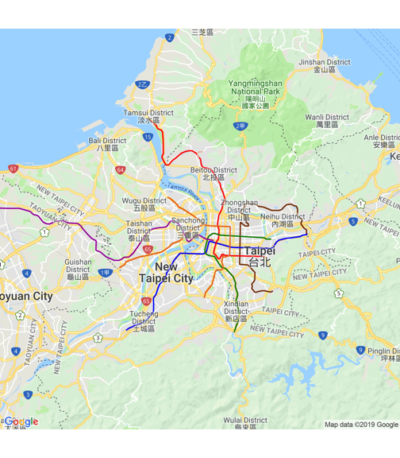

ggmap() 練習 
====================================
type:alert
incremental:true

- 利用get_googlemap() + ggmap()取得桃園地區的google 圖層
    - center = c(lon=121.20,lat=25.00)
    - zoom = 11
    - language = "zh-TW"
- 在長庚大學所在地 （座標121.389539,25.035225）加上一個紅色的點
    - geom_point()
    - x= 121.389539
    - y= 25.035225
    - color ="red"

ggmap() 練習輸出圖檔
====================================
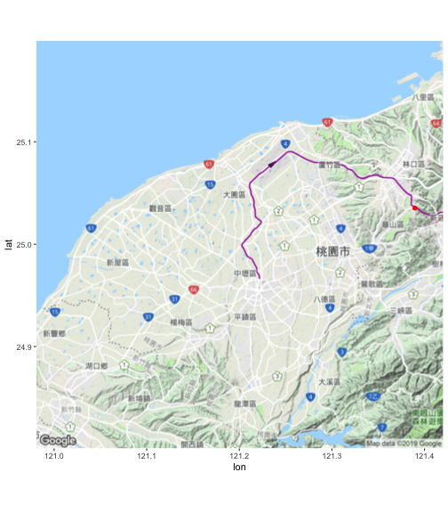


ggmap 參考資料
====================================
- [ggmap package source code](https://github.com/dkahle/ggmap)
- [ggmap cheat sheet](https://www.nceas.ucsb.edu/~frazier/RSpatialGuides/ggmap/ggmapCheatsheet.pdf)
- [ggmap doc](https://dl.dropboxusercontent.com/u/24648660/ggmap%20useR%202012.pdf)


Choropleth map面量圖
====================================
- Choropleth map[面量圖](https://en.wikipedia.org/wiki/Choropleth_map)
- **把統計資料用顏色畫在對應的地圖上**
- `choroplethr` package來畫面量圖
- 基於`ggplot2` package的`面量圖`做圖工具
- 建議同時安裝`choroplethrMaps` package

```r
##第一次使用前先安裝
install.packages(c("choroplethr",
                   "choroplethrMaps")) 
```

```r
library(choroplethr)
```

choroplethr package
====================================
- 內建美國各州地圖與人口學資料
- 使用`state_choropleth()`函式畫出美國人口分布

```r
data(df_pop_state) #記載各州人口數的資料
#把各州人口畫在地圖上
state_choropleth(df_pop_state) 
```

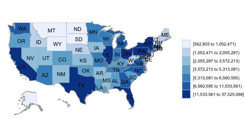

Taiwan的面量圖
====================================
type:sub-section 

- 台灣的面量圖尚無好的套件輔助
- Open Data: 台灣鄉鎮市邊界的經緯度檔案
    - [鄉鎮市區界線](http://data.gov.tw/node/7441)
    - 空間資料開放格式`shapefile` `.shp`
- 使用`shapefile`與`ggplot2`畫圖的步驟如下：
    - 取得空間資料檔案
    - 使用`rgdal`, `rgeos`,`maptools` package處理地圖檔shapefile
    - 使用`ggplot2` & `RColorBrewer` 畫圖
- [實作範例網址](http://yijutseng.github.io/DataScienceRBook/vis.html#taiwan)

Heatmap
====================================
type:sub-section 
- 熱度圖
- 使用顏色的深淺來表示數值的大小
- 搭配XY兩軸的變量
- 使用一張圖就能表示三個維度的資訊
- 在ggplot2套件中，可以使用`geom_tile()`來畫Heatmap
- 以下以NBA球員的資料作為範例

Heatmap
====================================

```r
#讀.csv檔案
nba <- read.csv("http://datasets.flowingdata.com/ppg2008.csv")
head(nba,3)
```

```
           Name  G  MIN  PTS  FGM  FGA   FGP FTM FTA   FTP X3PM X3PA  X3PP
1  Dwyane Wade  79 38.6 30.2 10.8 22.0 0.491 7.5 9.8 0.765  1.1  3.5 0.317
2 LeBron James  81 37.7 28.4  9.7 19.9 0.489 7.3 9.4 0.780  1.6  4.7 0.344
3  Kobe Bryant  82 36.2 26.8  9.8 20.9 0.467 5.9 6.9 0.856  1.4  4.1 0.351
  ORB DRB TRB AST STL BLK  TO  PF
1 1.1 3.9 5.0 7.5 2.2 1.3 3.4 2.3
2 1.3 6.3 7.6 7.2 1.7 1.1 3.0 1.7
3 1.1 4.1 5.2 4.9 1.5 0.5 2.6 2.3
```

Heatmap
====================================
為了做圖，將寬表轉長表

```r
library(reshape2) #for melt()
#寬表轉長表,以名字作依據
nba.m <- melt(nba,id.vars = "Name") 
head(nba.m,5)
```

|Name          |variable | value|
|:-------------|:--------|-----:|
|Dwyane Wade   |G        |    79|
|LeBron James  |G        |    81|
|Kobe Bryant   |G        |    82|
|Dirk Nowitzki |G        |    81|
|Danny Granger |G        |    67|

geom_tile()
====================================
將Geometric objects指定為`geom_tile()`

```r
library(ggplot2) #for ggplot()
ggplot(nba.m, aes(variable, Name)) + 
    geom_tile(aes(fill = value),
              colour = "white")+ 
    scale_fill_gradient(
        low = "white",high = "steelblue") 
```

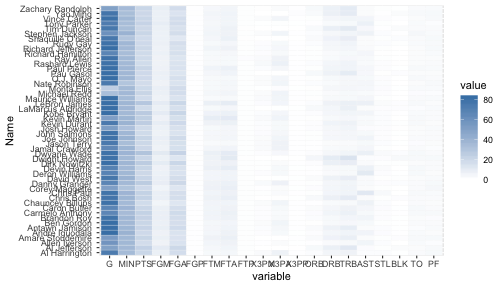

geom_tile() + scale()
====================================
- 因為G欄資料明顯大於其他欄位，導致顏色差異不明顯
- 將個欄位的資料標準化處理


```r
#scale處理
library(dplyr)
nba.s<-nba %>% 
    mutate_each(funs(scale), -Name) 
head(nba.s,2)
```

|Name         |         G|       MIN|      PTS|      FGM|      FGA|       FGP|      FTM|      FTA|        FTP|       X3PM|      X3PA|        X3PP|         ORB|        DRB|        TRB|      AST|      STL|       BLK|       TO|         PF|
|:------------|---------:|---------:|--------:|--------:|--------:|---------:|--------:|--------:|----------:|----------:|---------:|-----------:|-----------:|----------:|----------:|--------:|--------:|---------:|--------:|----------:|
|Dwyane Wade  | 0.6179300| 1.0019702| 3.179941| 2.920022| 2.596832| 0.5136017| 1.917475| 2.110772| -0.7401673| -0.1080044| 0.1303647| -0.15749098| -0.27213551| -0.3465676| -0.3287465| 1.652247| 2.558238| 1.2064646| 1.790445| -0.2984568|
|LeBron James | 0.7693834| 0.6119299| 2.566974| 1.957185| 1.697237| 0.4649190| 1.778729| 1.896589| -0.5233214|  0.4920201| 0.6971679|  0.02738974| -0.06117775|  1.0080940|  0.6605370| 1.516147| 1.367252| 0.8627425| 1.059651| -1.3903719|

geom_tile() + scale()
====================================

```r
nba.s.m <- melt(nba.s) ##寬轉長
ggplot(nba.s.m, aes(variable, Name)) + 
    geom_tile(aes(fill = value),
              colour = "white")+ 
    scale_fill_gradient(
        low = "white",high = "steelblue") 
```

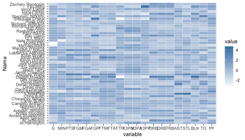

[How to Make a Heatmap – a Quick and Easy Solution](http://flowingdata.com/2010/01/21/how-to-make-a-heatmap-a-quick-and-easy-solution/)

Heatmap 練習 
====================================
type:alert
incremental:true

- 下載[小兒麻痺盛行率](https://raw.githubusercontent.com/CGUIM-BigDataAnalysis/BigDataCGUIM/master/104/POLIO_Incidence.csv)資料
- 將資料載入R
- 表格是寬表，需要轉成長表
- 有缺值 （-），用NA取代
    - 方法一 gsub()
    - 方法二 ifelse()
- 盛行率欄位轉換成數值
    - as.numeric()
- 用年份當x軸，州名當y軸，區塊顏色用盛行率填入
    - low = "white",high = "steelblue"

Treemap
====================================
type:sub-section 
- Treemap(矩形式樹狀結構繪圖法)
- 以二維平面的方式展示包含階層結構（hierarchical）形式的統計資訊
- `treemap` packages

treemap() data
====================================

```r
library(treemap)
data(GNI2014)
knitr::kable(head(GNI2014))
```


|   |iso3 |country          |continent     | population|    GNI|
|:--|:----|:----------------|:-------------|----------:|------:|
|3  |BMU  |Bermuda          |North America |      67837| 106140|
|4  |NOR  |Norway           |Europe        |    4676305| 103630|
|5  |QAT  |Qatar            |Asia          |     833285|  92200|
|6  |CHE  |Switzerland      |Europe        |    7604467|  88120|
|7  |MAC  |Macao SAR, China |Asia          |     559846|  76270|
|8  |LUX  |Luxembourg       |Europe        |     491775|  75990|

treemap()
====================================

```r
library(treemap)
data(GNI2014)
treemap(GNI2014,
       index=c("continent", "iso3"), #分組依據
       vSize="population", #區塊大小
       vColor="GNI", #顏色深淺
       type="value")
```


互動式資料呈現
====================================

- [互動式資料呈現](http://yijutseng.github.io/DataScienceRBook/InteractiveGraphics.html)
- [ggvis](http://yijutseng.github.io/DataScienceRBook/InteractiveGraphics.html#ggvis)
- [googleVis](http://yijutseng.github.io/DataScienceRBook/InteractiveGraphics.html#googlevis)
- [Plot.ly](http://yijutseng.github.io/DataScienceRBook/InteractiveGraphics.html#plot.ly)

參考資料
====================================
type:sub-section 

- 官方網站[文件](http://docs.ggplot2.org/current/)
- RStudio製作的[ggplot cheat sheet](https://www.rstudio.com/wp-content/uploads/2016/11/ggplot2-cheatsheet-2.1.pdf)
- DataCamp課程1 [Data Visualization with ggplot2 (Part 1)](https://www.datacamp.com/courses/data-visualization-with-ggplot2-1)
- DataCamp課程2 [Data Visualization with ggplot2 (Part 2)](https://www.datacamp.com/courses/data-visualization-with-ggplot2-2)
- DataCamp課程3 [Data Visualization with ggplot2 (Part 3)](https://www.datacamp.com/courses/data-visualization-with-ggplot2-3)
- [每個人心中都有一碗巷口的牛肉湯](http://tequila1979.blogspot.tw/2017/01/blog-post.html)

